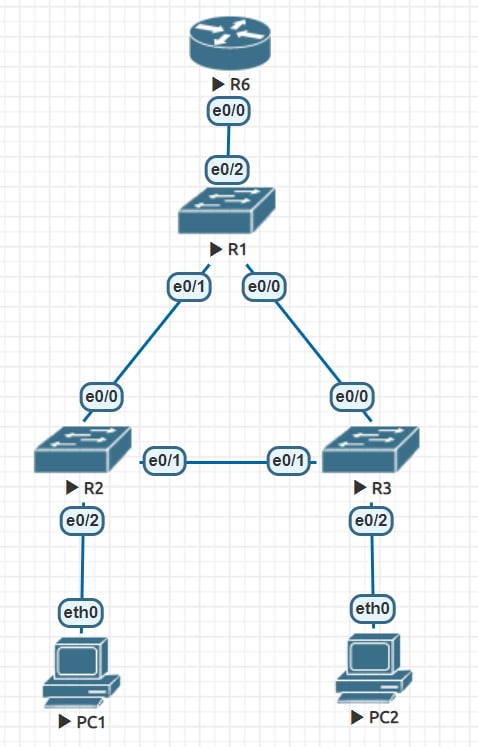
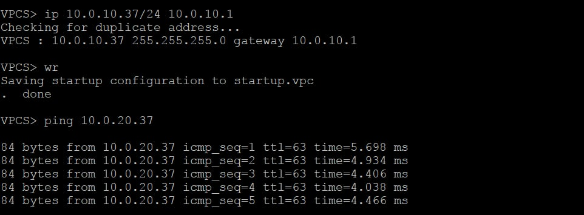
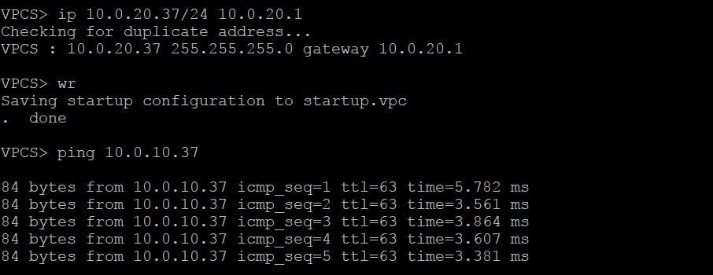
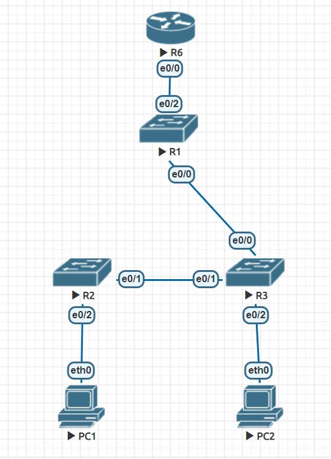
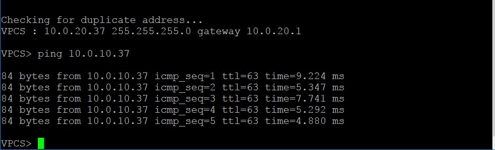

# lab 1

Все конфиги лежат в папочке conf

## Когда все линки в порядке
Топология выглядит так (после R3 сразу идет R6, так вышло)

Пинги работают

## Когда один линк не в порядке
Топология выглядит так

А пинг все равно проходит

